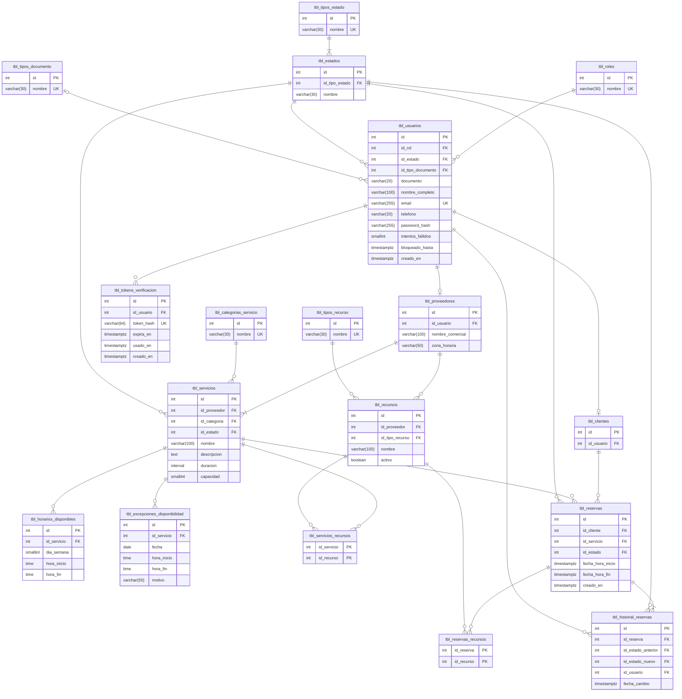

# Modelo de datos y paquetes — Sprint 1

Diseño aprobado para implementar las HU-01 a HU-07 y HU-09. Consolida el esquema físico de PostgreSQL, la estructura de paquetes hexagonal y el contrato de la API. **Reemplaza a `docs/db.md` y al diagrama `paquetes_&_componentes`** como fuente de verdad; esos diagramas deben actualizarse a partir de este documento.

La plataforma es **agnóstica al negocio**: cualquier establecimiento (clínica, peluquería, gimnasio, academia) se registra como proveedor y configura sus propios servicios, agenda y recursos.

## Decisiones clave

| Tema | Decisión | Motivo |
|------|----------|--------|
| Establecimiento | `proveedor` = establecimiento. Una instalación sirve a muchos | Multi-negocio sin multi-tenancy técnico |
| Catálogos de negocio | Categorías y tipos de recurso son datos, no enums | Un negocio nuevo no requiere cambiar código |
| Catálogos de sistema | Roles y estados son enums en código, sincronizados con filas semilla | Controlan reglas; no los edita un negocio |
| Capacidad | `capacidad` por servicio (1 = cita individual, N = clase grupal) | Agnóstico |
| Zona horaria | `zona_horaria` por proveedor | Agenda local de cada negocio |
| Nombres físicos | `snake_case`, plural, prefijo `tbl_` | PostgreSQL pliega identificadores a minúsculas |
| Migraciones | Flyway; Hibernate solo valida (`ddl-auto=validate`) | Migraciones versionadas (lineamientos §5.3) |
| Concurrencia | `SELECT … FOR UPDATE` sobre servicio y recursos al reservar | Evita sobreocupación bajo carreras |
| Dominio | Java puro, sin Spring ni JPA | Reglas testeables y aisladas |
| Aplicación | Servicios con `@Transactional` (pragmático) | Límite transaccional en el caso de uso |

---

## 1. Modelo de datos

### 1.1 Diagrama entidad-relación



### 1.2 Diccionario de datos

Todas las PK son `integer generated always as identity`, salvo las tablas puente (PK compuesta). Todas las FK son `NOT NULL` salvo donde se indique.

**Catálogos** — `tbl_roles`, `tbl_tipos_documento`, `tbl_tipos_estado`, `tbl_categorias_servicio`, `tbl_tipos_recurso`: `id`, `nombre varchar(30) NOT NULL UNIQUE`.

**`tbl_estados`**: `id`, `id_tipo_estado`, `nombre varchar(30) NOT NULL`. `UNIQUE (id_tipo_estado, nombre)`.

**`tbl_usuarios`**

| Columna | Tipo | Nulo | Regla |
|---------|------|------|-------|
| `id_rol` | int FK | no | |
| `id_estado` | int FK | no | Estado de tipo `USUARIO` |
| `id_tipo_documento` | int FK | sí | Nulo si y solo si `documento` es nulo (`CHECK`) |
| `documento` | varchar(20) | sí | `UNIQUE (id_tipo_documento, documento)` |
| `nombre_completo` | varchar(100) | no | |
| `email` | varchar(255) | no | Se guarda en minúsculas; índice único sobre `lower(email)` |
| `telefono` | varchar(20) | sí | |
| `password_hash` | varchar(255) | no | BCrypt |
| `intentos_fallidos` | smallint | no | Default `0`, `CHECK >= 0` |
| `bloqueado_hasta` | timestamptz | sí | Bloqueo temporal por intentos fallidos |
| `creado_en` | timestamptz | no | Default `now()` |

**`tbl_tokens_verificacion`**: `id_usuario`, `token_hash varchar(64) UNIQUE` (SHA-256 en hex; el token en claro nunca se guarda), `expira_en`, `usado_en` (nulo = sin usar), `creado_en`.

**`tbl_clientes`**: `id_usuario UNIQUE`.

**`tbl_proveedores`**: `id_usuario UNIQUE`, `nombre_comercial varchar(100) NOT NULL`, `zona_horaria varchar(50) NOT NULL DEFAULT 'America/Bogota'` (ID de zona IANA).

**`tbl_servicios`**

| Columna | Tipo | Regla |
|---------|------|-------|
| `id_proveedor`, `id_categoria`, `id_estado` | int FK | Estado de tipo `SERVICIO` |
| `nombre` | varchar(100) | `UNIQUE (id_proveedor, nombre)` |
| `descripcion` | text | Nulo permitido |
| `duracion` | interval | `CHECK (duracion > '0' AND duracion <= '8 hours')`; también es la duración del turno |
| `capacidad` | smallint | Default `1`, `CHECK >= 1`; reservas simultáneas por turno |

**`tbl_horarios_disponibles`**: `id_servicio`, `dia_semana smallint CHECK 1..7` (ISO: 1 = lunes), `hora_inicio time`, `hora_fin time`, `CHECK (hora_inicio < hora_fin)`. Los solapes se validan en dominio.

**`tbl_excepciones_disponibilidad`**: `id_servicio`, `fecha date`, `hora_inicio time` y `hora_fin time` (ambas nulas = día completo; si no, `hora_inicio < hora_fin`), `motivo varchar(50)`. Solo estructura en este sprint.

**`tbl_recursos`**: `id_proveedor`, `id_tipo_recurso`, `nombre varchar(100)`, `activo boolean DEFAULT true`. `UNIQUE (id_proveedor, nombre)`.

**`tbl_servicios_recursos`**: PK `(id_servicio, id_recurso)`. Recursos que **todo** turno del servicio ocupa. Servicio y recurso deben ser del mismo proveedor (regla de dominio).

**`tbl_reservas`**: `id_cliente`, `id_servicio`, `id_estado` (tipo `RESERVA`), `fecha_hora_inicio`, `fecha_hora_fin`, `creado_en`. `CHECK (fecha_hora_fin > fecha_hora_inicio)`.

**`tbl_reservas_recursos`**: PK `(id_reserva, id_recurso)`.

**`tbl_historial_reservas`**: `id_reserva`, `id_estado_anterior` (**nulo** en la creación), `id_estado_nuevo`, `id_usuario` (quién hizo el cambio), `fecha_cambio DEFAULT now()`.

### 1.3 Datos semilla

| Tabla | Valores |
|-------|---------|
| `tbl_roles` | `CLIENTE`, `PROVEEDOR`, `ADMIN` |
| `tbl_tipos_documento` | `CC`, `CE`, `TI`, `PASAPORTE`, `NIT` |
| `tbl_tipos_estado` | `USUARIO`, `SERVICIO`, `RESERVA` |
| `tbl_estados` | USUARIO: `PENDIENTE_VERIFICACION`, `ACTIVO`, `INACTIVO` · SERVICIO: `ACTIVO`, `INACTIVO` · RESERVA: `CONFIRMADA`, `CANCELADA`, `COMPLETADA` |
| `tbl_categorias_servicio` | `SALUD`, `BELLEZA`, `DEPORTE`, `EDUCACION`, `CONSULTORIA`, `OTRO` |
| `tbl_tipos_recurso` | `SALA`, `EQUIPO`, `PERSONAL` |

### 1.4 Índices

| Índice | Consulta que lo justifica |
|--------|---------------------------|
| `UNIQUE lower(email)` en `tbl_usuarios` | Login y detección de correo duplicado |
| `tbl_horarios_disponibles (id_servicio, dia_semana)` | Generar turnos y validar solapes |
| `tbl_reservas (id_servicio, fecha_hora_inicio)` | Cupo por turno, disponibilidad, conflictos al editar agenda |
| `tbl_reservas (id_cliente, fecha_hora_inicio)` | "Mis reservas" y solape del cliente |
| `tbl_reservas_recursos (id_recurso)` | Conflictos de recurso (HU-09) |
| `tbl_servicios (id_proveedor)`, `tbl_recursos (id_proveedor)` | Listados del proveedor |
| `tbl_tokens_verificacion (id_usuario)` | Reenvío e invalidación de tokens |

### 1.5 Cambios frente a `docs/db.md`

| Tabla | Cambio | Motivo |
|-------|--------|--------|
| Todas | `tblUsuario` → `tbl_usuarios`, etc. | Pliegue a minúsculas en PostgreSQL; el ERD mezclaba singular y plural |
| Catálogos y `tbl_estados` | `nombre` varchar(20) → varchar(30) | `PENDIENTE_VERIFICACION` tiene 22 caracteres |
| `tbl_usuarios` | + `password_hash`, `intentos_fallidos`, `bloqueado_hasta`, `creado_en`; documento, tipo y teléfono opcionales | HU-01 y HU-03 |
| `tbl_tokens_verificacion` | Nueva | HU-03: cuenta no verificada |
| `tbl_proveedores` | `nombre` → `nombre_comercial` varchar(100); + `zona_horaria` | Longitud y agnosticismo |
| `tbl_servicios` | `nombre` varchar(100); + `capacidad`; se elimina la relación extra con usuario | Agnosticismo; `id_proveedor` ya la cubre |
| `tbl_horarios_disponibles` | + `hora_inicio`; `hora_cerrado` → `hora_fin`; − `duracion_turno`; relación N:1 | Bloque sin inicio; dos duraciones contradictorias |
| `tbl_excepciones_disponibilidad` | + `hora_inicio`; `fehca` → `fecha` | Bloque sin inicio; typo |
| `tbl_recursos` | `id_servicio` → `id_proveedor`; + `nombre`, `id_tipo_recurso`, `activo`; − relación con usuario | Recursos compartidos entre servicios |
| `tbl_tipos_recurso`, `tbl_servicios_recursos`, `tbl_reservas_recursos` | Nuevas | HU-09 |
| `tbl_historial_reservas` | Typo corregido; + `id_estado_nuevo`, `id_usuario`; `id_estado_anterior` opcional | El ERD dibujaba la relación con usuario sin columna |
| `tbl_reservas` | + `creado_en` | Auditoría |

---

## 2. Paquetes

### 2.1 Estructura

```
co.reservas
├── domain                          Java puro: entidades, value objects, reglas, excepciones
│   ├── shared
│   ├── usuario                     Usuario, Rol, EstadoUsuario, Cliente, Proveedor, PoliticaBloqueo
│   ├── servicio                    Servicio, EstadoServicio
│   ├── agenda                      HorarioDisponible, GeneradorTurnos, Turno
│   ├── recurso                     Recurso
│   └── reserva                     Reserva, EstadoReserva, HistorialReserva
├── application
│   ├── port/in/<modulo>            Interfaces de casos de uso + comandos/resultados (records)
│   ├── port/out/<modulo>           Puertos de salida (*RepositoryPort, PasswordHasherPort, TokenEmisorPort, NotificacionPort)
│   └── service/<modulo>            Implementación de los casos de uso
├── adapters
│   ├── in/web/<modulo>             Controllers REST + DTOs de request/response
│   ├── in/web/error                ErrorResponse, GlobalExceptionHandler
│   ├── out/persistence/<modulo>    *Entity (JPA), *JpaRepository (Spring Data), *RepositoryJpaAdapter, mappers
│   ├── out/security                BCryptPasswordHasherAdapter, JwtTokenEmisorAdapter
│   └── out/mail                    SmtpNotificacionAdapter
└── infrastructure
    ├── ReservasServiciosApplication
    ├── config                      JpaConfig, OpenApiConfig, ClockConfig
    ├── security                    SecurityConfig, manejadores 401/403
    └── web                         TraceIdFilter
```

Módulos: `auth`, `usuario`, `servicio`, `agenda`, `recurso`, `reserva`.

### 2.2 Reglas de dependencia

| Capa | Puede depender de | No puede depender de |
|------|-------------------|----------------------|
| `domain` | Solo JDK | Spring, JPA, Jackson, cualquier otra capa |
| `application` | `domain` | `adapters`, `infrastructure`, JPA |
| `adapters` | `application`, `domain` | Otros adaptadores |
| `infrastructure` | Todas | — |

Las entidades JPA nunca salen de `adapters.out.persistence`; los DTOs web nunca entran a `application`.

### 2.3 Casos de uso y endpoints por HU

Todos bajo `/api/v1`.

| HU | Caso de uso | Endpoint | Rol |
|----|-------------|----------|-----|
| HU-01, HU-02 | `RegistrarUsuarioUseCase` | `POST /auth/registro` | Público |
| HU-03 | `VerificarCuentaUseCase` | `GET /auth/verificacion?token=` | Público |
| HU-03 | `ReenviarVerificacionUseCase` | `POST /auth/verificacion/reenvio` | Público |
| HU-03 | `IniciarSesionUseCase` | `POST /auth/login` | Público |
| HU-04 | `CrearHorarioUseCase` | `POST /servicios/{idServicio}/horarios` | PROVEEDOR dueño |
| HU-04 | `ConsultarHorariosUseCase` | `GET /servicios/{idServicio}/horarios` | Público |
| HU-05 | `EditarHorarioUseCase` | `PUT /horarios/{id}?confirmar=false` | PROVEEDOR dueño |
| HU-06 | `EliminarHorarioUseCase` | `DELETE /horarios/{id}?confirmar=false` | PROVEEDOR dueño |
| HU-07 | `ConsultarDisponibilidadUseCase` | `GET /servicios/{idServicio}/disponibilidad?desde=&hasta=` | Público |
| HU-07, HU-09 | `CrearReservaUseCase` | `POST /reservas` | CLIENTE |
| HU-07 | `ConsultarReservasUseCase` | `GET /reservas/mias` · `GET /servicios/{idServicio}/reservas` | CLIENTE · PROVEEDOR dueño |
| HU-09 | `GestionarRecursosUseCase` | `POST /recursos` · `GET /recursos` · `PUT /servicios/{idServicio}/recursos` | PROVEEDOR |
| Soporte | `GestionarServiciosUseCase` | `POST /servicios` (PROVEEDOR) · `GET /servicios` · `GET /servicios/{id}` (públicos) | — |
| Soporte | `ConsultarCatalogosUseCase` | `GET /catalogos/categorias` · `/tipos-recurso` · `/tipos-documento` | Público |

Componentes nuevos frente al diagrama original: `AuthController`, `ServicioController`, `RecursoController`, `CatalogoController`. Quedan fuera de este sprint: `CancelarReservaUseCase`, `GenerarReporteOcupacionUseCase` y `ReporteController`.

---

## 3. Contrato de errores

Todas las respuestas de error (incluidas 401 y 403 de seguridad) usan el mismo cuerpo:

```json
{
  "errorCode": "RECURSO_NO_DISPONIBLE",
  "message": "Uno o más recursos del servicio ya están ocupados en ese horario.",
  "details": [ { "tipo": "SUGERENCIA", "fechaHoraInicio": "2026-09-21T10:00:00-05:00", "fechaHoraFin": "2026-09-21T10:30:00-05:00" } ],
  "traceId": "3f2a…",
  "timestamp": "2026-09-17T15:04:05Z"
}
```

| HTTP | `errorCode` |
|------|-------------|
| 400 / 415 | `VALIDACION_FALLIDA` (details: `campo`, `mensaje`), `SOLICITUD_INVALIDA` (también para 415), `SERVICIO_REQUERIDO`, `TOKEN_VERIFICACION_INVALIDO` |
| 401 | `NO_AUTENTICADO`, `CREDENCIALES_INVALIDAS` |
| 403 | `ACCESO_DENEGADO`, `CUENTA_NO_VERIFICADA`, `CUENTA_INACTIVA` |
| 404 | `SERVICIO_NO_ENCONTRADO`, `HORARIO_NO_ENCONTRADO`, `RECURSO_NO_ENCONTRADO`, `CATEGORIA_NO_ENCONTRADA`, `TIPO_RECURSO_NO_ENCONTRADO`, `RUTA_NO_ENCONTRADA` |
| 405 | `METODO_NO_PERMITIDO` |
| 409 | `EMAIL_YA_REGISTRADO`, `SERVICIO_YA_REGISTRADO`, `RECURSO_YA_REGISTRADO`, `HORARIO_SOLAPADO`, `HORARIO_CON_RESERVAS`, `TURNO_SIN_CUPO`, `RECURSO_NO_DISPONIBLE`, `RESERVA_SOLAPADA` |
| 422 | `RESERVA_EN_EL_PASADO`, `HORARIO_NO_DISPONIBLE`, `SERVICIO_NO_DISPONIBLE`, `BLOQUE_MENOR_A_DURACION` |
| 423 | `CUENTA_BLOQUEADA` |
| 500 | `ERROR_INTERNO` (sin detalles internos) |

---

## 4. Reglas de negocio por HU

### HU-01 / HU-02 — Registro
- Un solo endpoint con `rol` = `CLIENTE` o `PROVEEDOR`. `ADMIN` no se autoregistra.
- Campos: `nombreCompleto` (2–100), `email`, `password` (12–64 caracteres, sin reglas de composición), `rol`. Proveedor además: `nombreComercial` (opcional, por defecto el nombre completo), `zonaHoraria` (opcional, ID IANA válido) y `servicios`.
- El email se normaliza (`trim` + minúsculas). Si ya existe → `409 EMAIL_YA_REGISTRADO`.
- Proveedor sin servicios → `400 SERVICIO_REQUERIDO`. Cliente con servicios → `400 VALIDACION_FALLIDA`.
- Cada servicio: `nombre`, `descripcion?`, `idCategoria`, `duracionMinutos` (5–480), `capacidad` (≥ 1, por defecto 1).
- Todo se crea en una transacción: usuario en `PENDIENTE_VERIFICACION`, fila de cliente o proveedor, servicios en `ACTIVO` y token de verificación (32 bytes aleatorios, vigencia de 24 h).
- El correo de verificación se envía **después del commit**; si falla, se registra en el log y el usuario puede pedir reenvío.
- Respuesta `201`: `id`, `email`, `rol`, `estado` y un mensaje de confirmación.

### HU-03 — Verificación e inicio de sesión
- Verificación: token válido, sin usar y vigente → usuario `ACTIVO`, token marcado como usado. Si no → `400 TOKEN_VERIFICACION_INVALIDO`.
- Reenvío: siempre responde `202`, exista o no el correo; invalida los tokens anteriores.
- Login, en orden:
  1. Correo inexistente → se ejecuta un hash ficticio (tiempo constante) y `401 CREDENCIALES_INVALIDAS`.
  2. Cuenta bloqueada (`bloqueado_hasta > ahora`) → `423 CUENTA_BLOQUEADA` solo si la contraseña es correcta; si no, `401`. Durante el bloqueo no se suman intentos.
  3. Contraseña incorrecta → `intentos_fallidos + 1`. Al llegar a **5**, `bloqueado_hasta = ahora + 15 min` y el contador vuelve a 0. `401 CREDENCIALES_INVALIDAS`.
  4. Contraseña correcta → contador a 0. `PENDIENTE_VERIFICACION` → `403 CUENTA_NO_VERIFICADA`; `INACTIVO` → `403 CUENTA_INACTIVA`.
  5. Éxito → `200` con `accessToken` (JWT HS256, 30 min), `tokenType: "Bearer"`, `expiresIn`, `rol` y `redirectTo` (`/panel/cliente`, `/panel/proveedor` o `/panel/admin`).
- Los intentos, el bloqueo y la expiración son configurables. Eventos de seguridad (`LOGIN_EXITOSO`, `LOGIN_FALLIDO`, `CUENTA_BLOQUEADA`) se registran con el id de usuario, nunca con el correo ni la contraseña.

### HU-04 — Crear agenda
- Cuerpo: `diasSemana` (lista 1–7), `horaInicio`, `horaFin`. Crea un bloque por día, todo o nada.
- El servicio debe existir (`404`) y pertenecer al proveedor autenticado (`403 ACCESO_DENEGADO`).
- `horaInicio < horaFin`, y el bloque debe durar al menos la duración del servicio (`422 BLOQUE_MENOR_A_DURACION`).
- Sin solapes con otros bloques del mismo servicio y día (`409 HORARIO_SOLAPADO`).

### HU-05 / HU-06 — Editar y eliminar agenda
- Mismas validaciones de propiedad y forma que HU-04 (el solape excluye al propio bloque).
- **Reserva afectada**: reserva `CONFIRMADA`, futura, del mismo servicio, cuyo inicio (en la zona del proveedor) cae en el día y rango del bloque original y que ya no cabe en el bloque nuevo. Al eliminar, todas las que caen en el bloque.
- Con reservas afectadas y `confirmar=false` → `409 HORARIO_CON_RESERVAS` con la lista en `details` (`idReserva`, `fechaHoraInicio`, `fechaHoraFin`).
- Con `confirmar=true` → se aplica el cambio y **las reservas se mantienen**. Respuesta `200` con el bloque (si se editó) y `reservasAfectadas`.

### HU-07 — Crear reserva
- Cuerpo: `idServicio`, `fechaHoraInicio` (ISO-8601 con offset). `fechaHoraFin = inicio + duracion`.
- Validaciones, en orden:
  1. Servicio existente (`404`) y `ACTIVO` (`422 SERVICIO_NO_DISPONIBLE`).
  2. Inicio futuro (`422 RESERVA_EN_EL_PASADO`).
  3. El inicio coincide con un turno generado: dentro de un bloque del día (zona del proveedor) y alineado a `hora_inicio + k × duracion` (`422 HORARIO_NO_DISPONIBLE` con sugerencias).
  4. Se bloquea la fila del servicio (`FOR UPDATE`); reservas `CONFIRMADA` con el mismo inicio `< capacidad` (`409 TURNO_SIN_CUPO` con sugerencias).
  5. El cliente no tiene otra reserva `CONFIRMADA` que se solape (`409 RESERVA_SOLAPADA`).
  6. Recursos: ver HU-09.
- Se crea en `CONFIRMADA`, con sus recursos y una fila de historial (`id_estado_anterior` nulo). Respuesta `201` con la reserva y sus recursos.
- **Disponibilidad**: `desde`/`hasta` son fechas en la zona del proveedor, con un rango máximo de 31 días. Devuelve los turnos futuros con `cuposDisponibles > 0` y sin recursos ocupados.

### HU-09 — Controlar disponibilidad de recursos
- La reserva ocupa **todos** los recursos activos asociados al servicio.
- Los recursos se bloquean `FOR UPDATE` en orden de id (evita deadlocks).
- Un recurso está ocupado si tiene una reserva `CONFIRMADA` que se solapa en tiempo, salvo que sea del **mismo servicio y el mismo inicio** (turno grupal compartido).
- Si hay conflicto → `409 RECURSO_NO_DISPONIBLE` con los recursos en conflicto y hasta **3 turnos sugeridos** de los próximos 14 días.
- Un proveedor solo puede asociar recursos propios y activos a servicios propios.

---

## 5. Pendiente y fuera de alcance

| Tema | Estado |
|------|--------|
| Cancelar reserva, reportes de ocupación | Fuera de este sprint |
| MFA para administradores, refresh tokens y revocación | Sprint 3 ("aseguramiento mediante tokens") |
| Endpoints de excepciones de disponibilidad | Solo existe la tabla |
| Procedimiento almacenado o trigger | Sprint 3 (Bases de Datos) |
| Actualizar `docs/db.md` y el diagrama de paquetes | Hacerlo con este documento como fuente |
